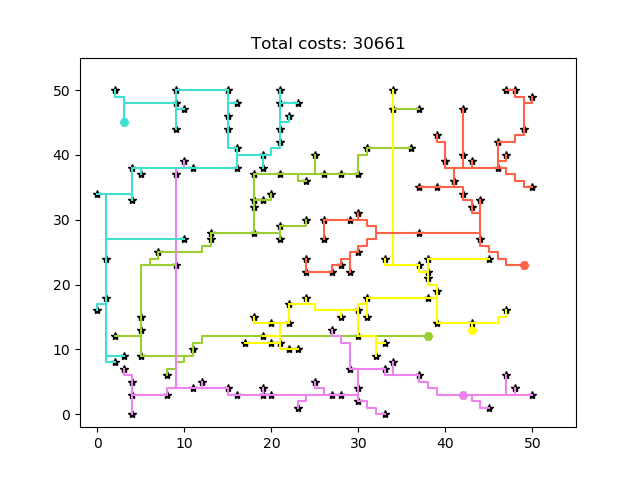
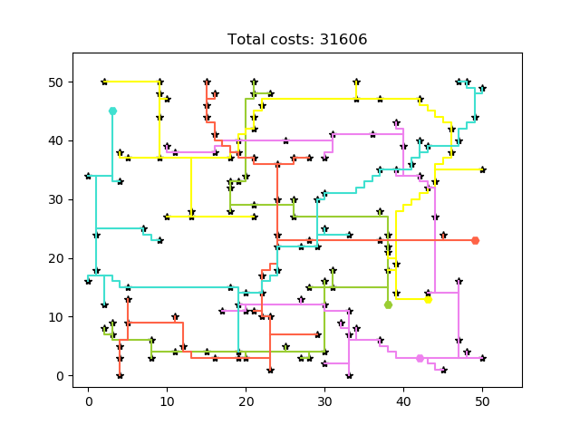
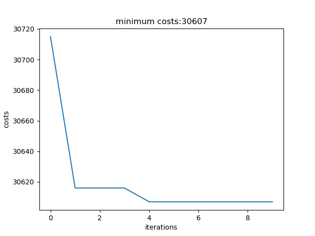
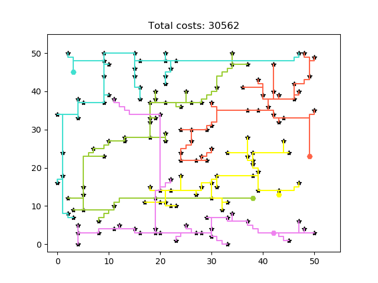
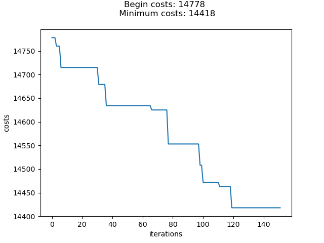
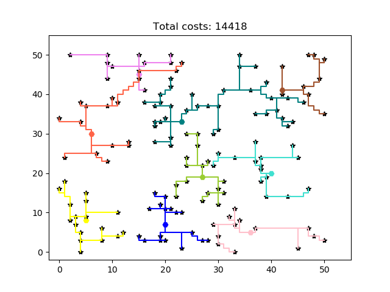
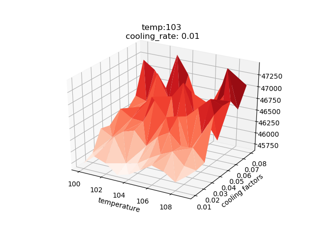

# Smart Grid
 > More and more people are starting to generate their own energy. Often times, they generate more than they can use. The surplus could > be sold back to the energy supplier, however the infrastucture is not build for that. To manage this, batteries should be placed to > store the leftover energy. 

 > To handle this, we are tasked to find an optimum configuration by assigning houses to batteries. 
 > In doing so, we explored the case by finding different ways to construct allocations. In this file, figures 
 > can be found of some of the results. These are not all possible results, however, it gives a good idea of the progress we made.


## Getting Started

### Prerequisites

The codebase is written in its entirety in [Python3.8.1](https://www.python.org/downloads/). Requirements.txt contains all the necessary packages to successfully run the code. These are easily installed with the following instuction:

```
pip install -r requirements.txt
```

### Structure

All the Python scripts are located in the "code" folder. The "data" map contains all the input values. The results are stored in "results" folder.

### Testing

To run the code with the standard configuration use the instruction:

```
python main.py
```

## Authors

* Amparo Gilhuis
* Rens Hofstee
* Samy van Stokkum

## Acknowledgments

* StackOverflow
* Minor Programming from the UvA
* Marleen and Julien


### Figures

> Figure 1: "District 1; with greedy and no optimization"


> Figure 2: "District 1; with random and Simulated Annealing


> Figure 3: "District 1; with greedy and HillClimber Steepest Ascent"

> 3a. Costs


> 3b. Grid



> Figure 4: "District 1; with cluster and Simulated Annealing, Shared Lines and Advanced options"

> 4a. Costs


> 4b. Grid


> Figure 5: "Exploration of Simulated Annealing parameters (costs are presented on the Z-axis)."

